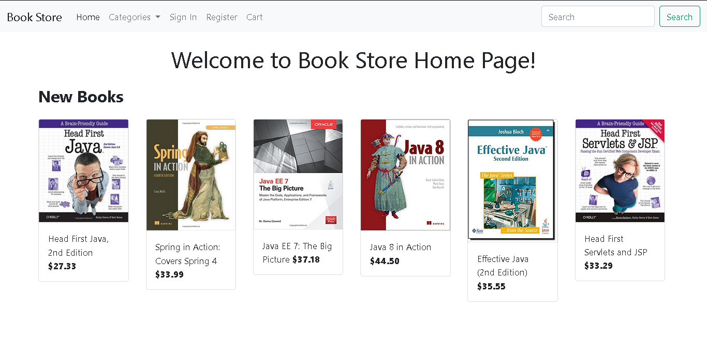
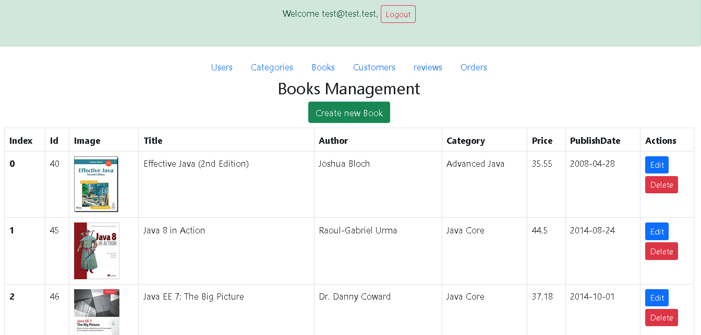
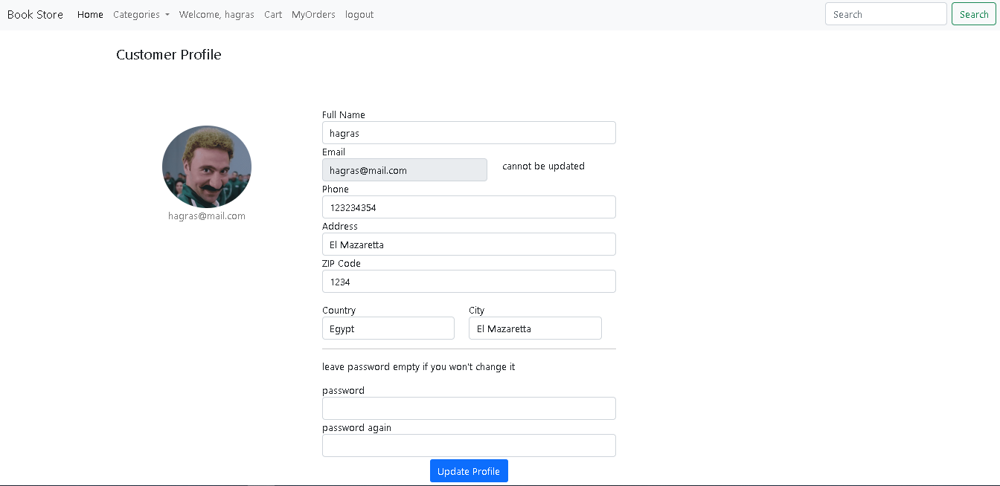
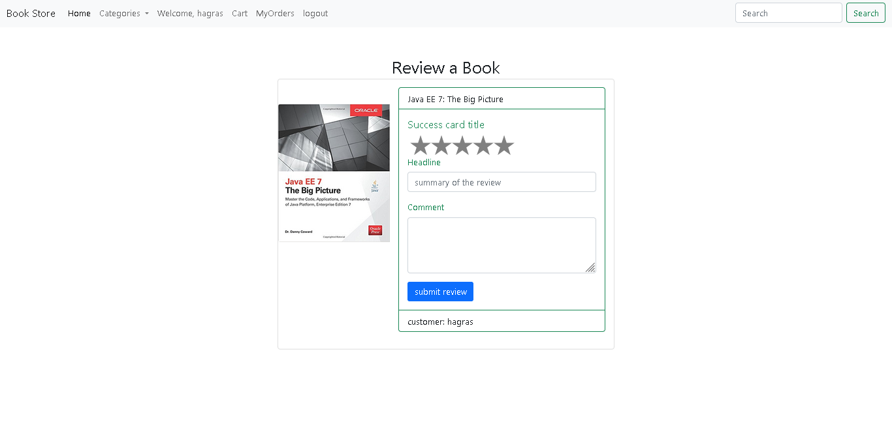

# E-Commerce Book Store
>  Fully Functional E-commerce book website using Java EE Technologies.
- My Focus is on the Backend. I didn't give too much for the front end.
- 📝Technical skills I learned from doing this project.
- ✅ Unit Testing
- ✅ MVC Design pattern and organizing the code
- ✅ Debugging and problem solving

## Table of Contents
* [Technologies Used](#technologies-used)
* [Features](#features)
* [Acknowledgements](#acknowledgements)

## Technologies Used
- JAVA 8
- JSP
- Servlet
- Hibernate
- MySQL
- Junit4

## Features
- Unitl Now these are the features done
- 👨‍💼 For the admin dashboard
-   ✅ Login to the admin dashboard.
-   ✅ Create, delete, update and list Users who manage the book store.
-   ✅ Create, delete, update and list Categories.
-   ✅ Create, delete, update and list Books with it's book image displayed.
-   ✅ Create, delete, update and list Customers.
-   ✅ delete, update and list customers review's.
- 🧑 For website visitors
-   ✅ Display books by category.
-   ✅ Display new published books on the home page.
-   ✅ Display a certain book details.
-   ✅ Search for books by title or description or author.
-   ✅ Customer Registeration and Login
- 👨‍💼 For loged in customers
-   ✅ View customer profile and update profile.
-   ✅ Write a review and and rate a book.

## Acknowledgements
- This project was based on [this tutorial](https://bit.ly/3NFR3ZC).
- Many thanks to Nam Ha Minh

